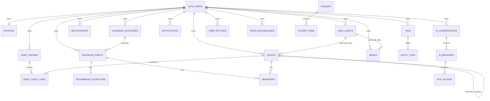

# 루멘왕국 공주의 하루 — 기준 ERD

이 문서는 Princess OS의 기준 데이터 모델이다. 프런트엔드 타입, Supabase 스키마, RLS 정책은 이 관계를 따라야 한다.



## 핵심 원칙

1. 모든 사용자 데이터는 `user_id`를 가진다.
2. `main_quests`는 필수 부모가 아니라 퀘스트가 선택적으로 연결되는 프로젝트다.
3. 일일퀘스트와 서브퀘스트는 `quests.kind`로 구분한다.
4. `quests.main_quest_id`와 `quests.parent_quest_id`는 모두 nullable이다. 둘 다 없으면 독립 퀘스트다.
5. 프로젝트 진행률은 연결된 퀘스트 완료 비율로 계산한다. 연결된 퀘스트가 없을 때만 `manual_progress`를 사용한다.
6. 도서관은 별도 원본 테이블이 아니다. 프로젝트·퀘스트·다이어리·비망록·인연록의 통합 검색 화면이다.
7. 연결 테이블도 `user_id`를 가지며, 복합 FK로 같은 사용자의 레코드끼리만 연결한다.
8. 날짜는 `date`, 시각은 `time`, 실행 시점과 감사 기록은 `timestamptz`로 저장한다.
9. 사용자의 업무일은 프로필의 시간대에서 오전 6시에 바뀐다. 저장 날짜를 임의로 변경하지 않고 조회 시 `service_date`로 계산한다.
10. 데모 왕국은 실제 사용자 테이블에 쓰지 않는다.

## 소유권 경계

일반 RLS 조건은 다음과 같다.

```sql
using (auth.uid() = user_id)
with check (auth.uid() = user_id)
```

RLS만으로는 다른 사용자의 부모 ID를 참조하는 것을 막을 수 없으므로 관계에는 복합 FK를 사용한다.

```text
quests(main_quest_id, user_id)
  -> main_quests(id, user_id)

diary_quest_links(diary_id, user_id)
  -> diary_entries(id, user_id)

diary_quest_links(quest_id, user_id)
  -> quests(id, user_id)
```

## Library projection

도서관 레코드의 안정적인 키는 `{type}:{source_id}` 형식으로 만든다.

| 도서관 분류 | 원본 |
| --- | --- |
| 전체 기록 | 아래 원본의 합집합 |
| 메인퀘스트 | `main_quests` |
| 일일퀘스트 | `quests where kind = 'daily'` |
| 서브퀘스트 | `quests where kind = 'sub'` |
| 인연록 | `relationships` |
| 비망록 | `memos` |
| 다이어리 | `diary_entries` |

검색 대상은 제목, 상세 내용, 메모, 태그이며 원본 레코드의 수정·삭제 결과가 즉시 도서관에 반영돼야 한다.

## Storage

사용자 파일은 private bucket에 다음 경로로 저장한다.

```text
{user_id}/{room_key}/{uuid}.{extension}
```

`room_key`는 `rita`, `lobby`, `office`, `calendar`, `library`, `diary`, `garden`, `throne` 중 하나다. Storage 정책은 첫 번째 경로 조각이 `auth.uid()`인지 SELECT/INSERT/UPDATE/DELETE 모두에서 확인한다.

## 이행 상태

- 현재 프런트엔드는 이미 통합 `Quest` 모델을 사용한다.
- 현재 Supabase는 `daily_quests`와 `sub_quests`가 분리돼 있다.
- `supabase/migrations/202607120001_canonical_data_model.sql`은 두 레거시 테이블을 삭제하지 않고 `quests`로 복사한다.
- 프런트 저장소가 `quests`로 전환되고 검증되기 전까지 레거시 테이블은 읽기 전용 호환 소스로 유지한다.
