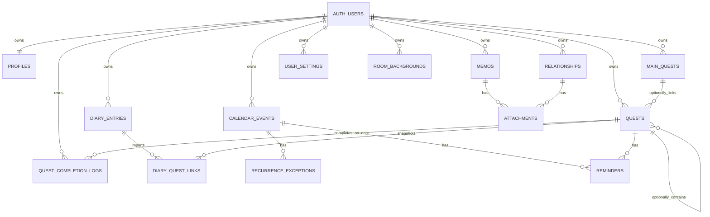

# 루멘왕국 공주의 하루 — 기준 ERD



## 소유권 관계

모든 RLS 대상의 기본 조건은 다음과 같다.

```sql
using (auth.uid() = user_id)
with check (auth.uid() = user_id)
```

연결 대상도 같은 사용자임을 보장하도록 복합 FK를 사용한다.

```text
quests(main_quest_id, user_id) -> main_quests(id, user_id)
quest_completion_logs(quest_id, user_id) -> quests(id, user_id)
diary_quest_links(diary_id, user_id) -> diary_entries(id, user_id)
```

## 반복 퀘스트 생명주기

```text
quests: 제목·연결·RRULE을 가진 원본 템플릿
  ↓ 사용자가 특정 서비스일에 완료
quest_completion_logs: (quest_id, occurrence_date, completed_at)
  ↓ 다음 서비스일
새 날짜의 로그가 없으므로 화면에서는 자동 미완료
```

이 구조에서는 새 날짜가 시작될 때 원본 퀘스트를 수정하지 않는다. 따라서 과거 완료 이력, 다이어리 가져오기, 여러 기기 동기화가 서로 충돌하지 않는다.
